# Medi Platform — Structured Diagrams (Mermaid)

This document contains ready-to-render diagrams (Mermaid) that explain the system end-to-end and also cover the evaluation topics from your image:
- Technical Feasibility
- Market Analysis
- Business Model
- Revenue Generation
- Innovation
- Implementation
- Overall Project Complexity
- Novelty
- Uniqueness
- Overall Feasibility

> Tip: Mermaid diagrams render in GitHub, many Markdown previewers, and VS Code extensions.

---

## 1) End-to-End System Process (Core)

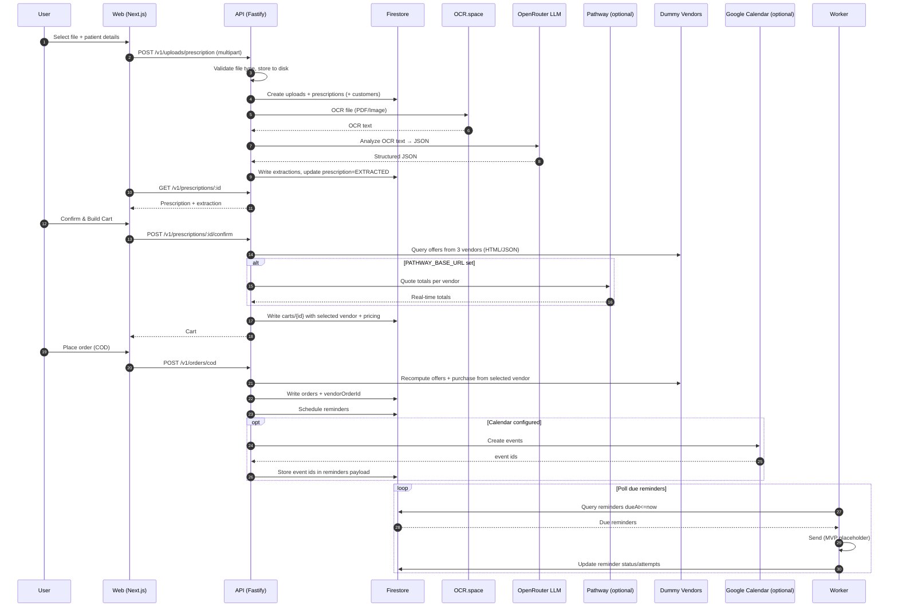

---

## 2) Technical Feasibility

### 2.1 Architecture feasibility (components and dependencies)
```mermaid
flowchart TB
  subgraph Client
    W[Web UI\nNext.js]
  end

  subgraph Backend
    A[API\nFastify]
    K[Worker\nNode/TS]
  end

  subgraph Storage
    F[(Firestore)]
    S[(Local disk\nUPLOAD_DIR)]
  end

  subgraph External
    O[OCR.space]
    R[OpenRouter LLM]
    P[Pathway\n(optional)]
    C[Google Calendar\n(optional)]
  end

  W -->|HTTP| A
  A --> S
  A --> F
  K --> F
  A --> O
  A --> R
  A --> P
  A --> C

  style P stroke-dasharray: 5 5
  style C stroke-dasharray: 5 5
```

### 2.2 Feasibility checkpoints
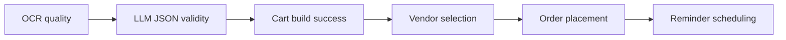

---

## 3) Market Analysis

### 3.1 Stakeholder map
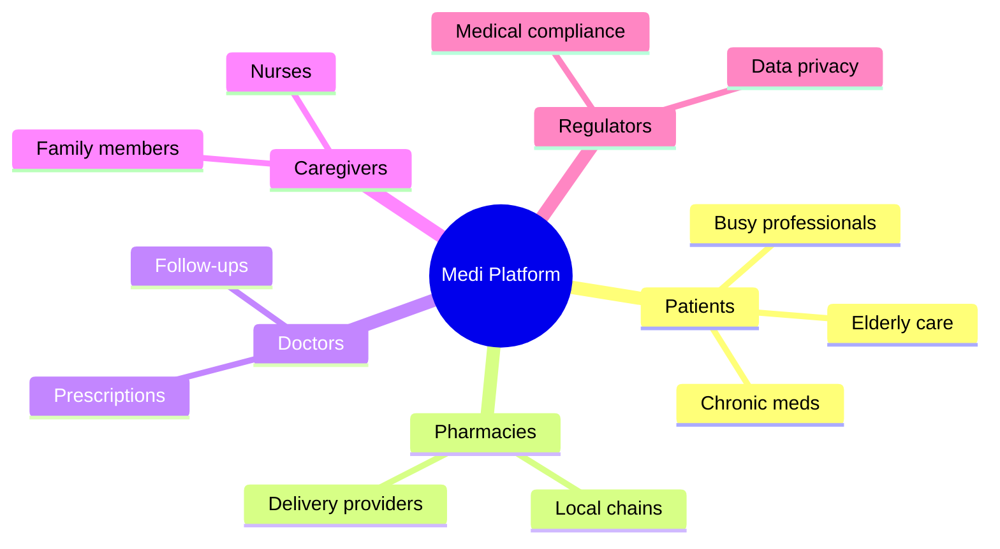

### 3.2 Value chain (where the product sits)
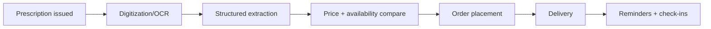

---

## 4) Business Model

### 4.1 Business model blocks (high-level)
```mermaid
flowchart TB
  V[Value Proposition]\n"Fast prescription-to-order" 
  C[Customer Segments]\nPatients & caregivers
  P[Partners]\nPharmacies, logistics, OCR/LLM providers
  R[Revenue]\nCommission, subscription, SaaS
  K[Key Activities]\nExtraction, vendor selection, ordering, reminders
  S[Costs]\nOCR/LLM usage, infra, support

  V --> C
  V --> P
  V --> K
  R --> V
  S --> K
```

---

## 5) Revenue Generation

```mermaid
flowchart LR
  A[Per-order commission] --> R((Revenue))
  B[Subscription\n(patients/caregivers)] --> R
  C[SaaS licensing\n(to pharmacies/clinics)] --> R
  D[Premium reminders\n(voice + adherence)] --> R
  E[Analytics (aggregated)\nB2B reporting] --> R
```

---

## 6) Innovation

### 6.1 “Automation loop” innovation: extraction → compare → purchase → adherence
```mermaid
flowchart LR
  X[OCR + LLM extraction] --> Y[Vendor compare\n(3 sources)]
  Y --> Z[Auto purchase\n(COD)]
  Z --> A[Adherence reminders\n(Calendar + worker)]
  A --> X
```

### 6.2 What is “new” in the MVP
```mermaid
flowchart TB
  E[Explainable extraction\n(JSON + confidence)] --> I[Auto cart build]
  I --> Q[Real-time quote\n(Pathway optional)]
  Q --> P[Vendor purchase + history]
  P --> R[Reminders after order]
```

---

## 7) Implementation

### 7.1 Implementation phases
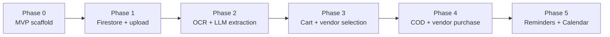

### 7.2 Prescription lifecycle state machine
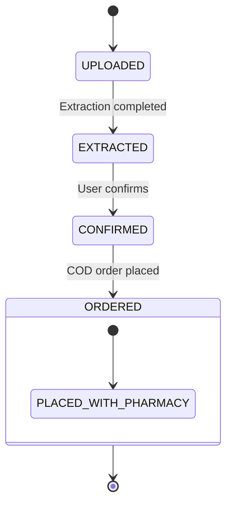

---

## 8) Overall Project Complexity

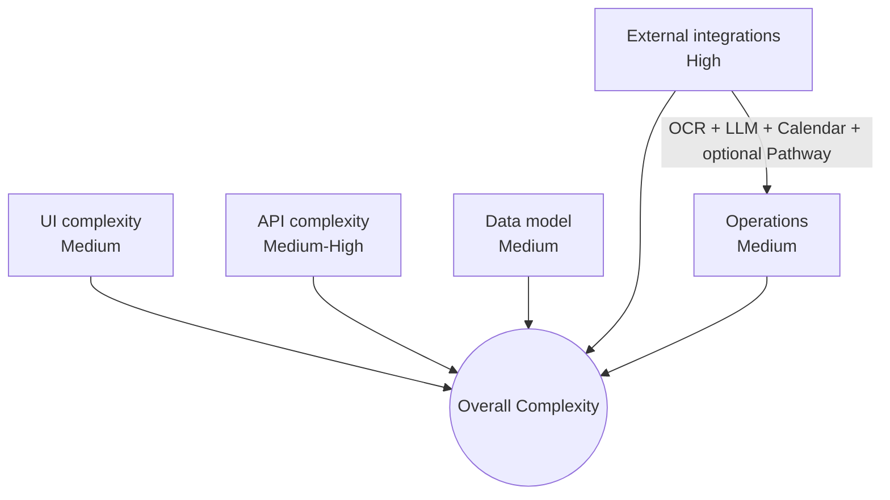

---

## 9) Novelty

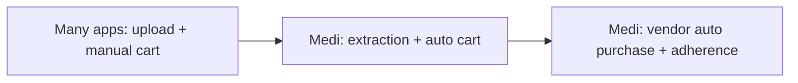

---

## 10) Uniqueness

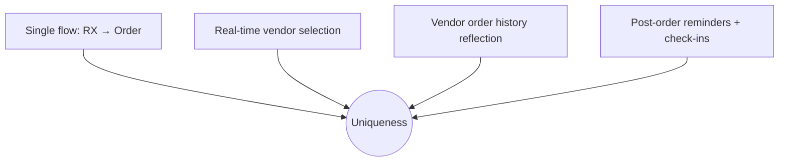

---

## 11) Overall Feasibility

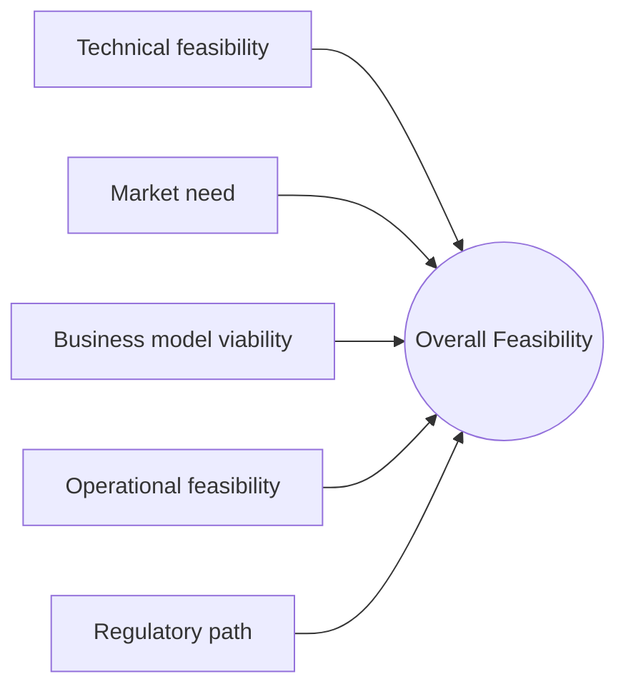

### 11.1 Risk register (visual)
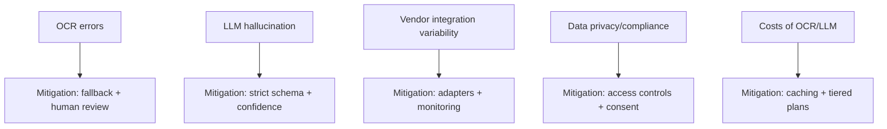
